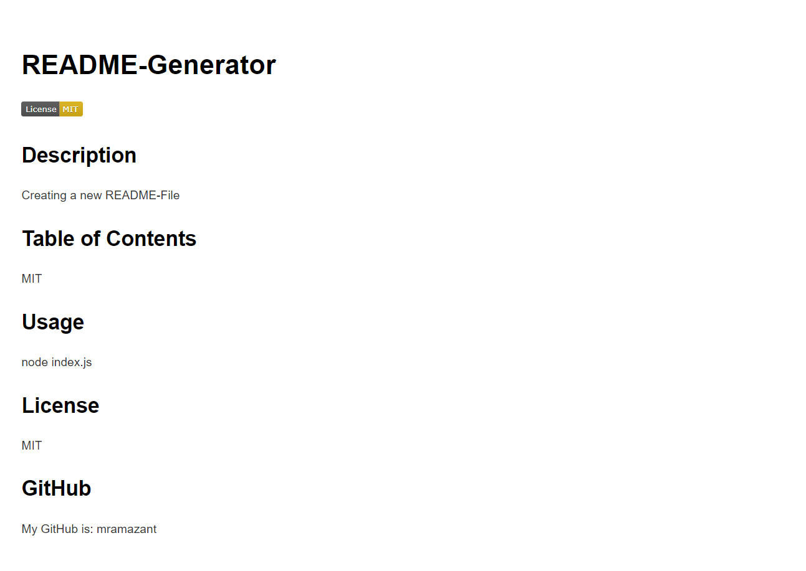

# README-Generator

## Description

This application helps you to create a README-File more easily and quickly. What you need to do for this is to answer the questions about the readme file content completely. Then, when you start the application from the terminal, your new readme file will be created automatically.

